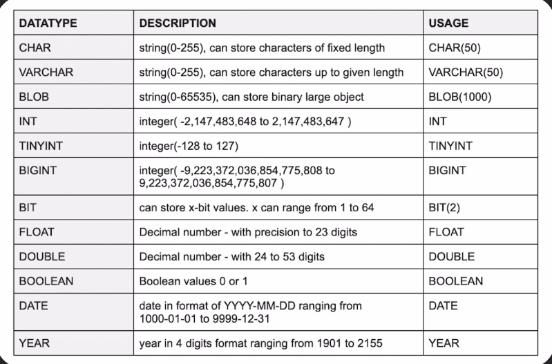

# SQL Basic Commands:

### Database Creation & Deletion

_Create Database:_ `CREATE DATABASE db_name`</br>
_Drop Database:_ `DROP DATABASE db_name`</br>

### Table Creation

_Use Database:_ `USE db_name`</br>
_Table Creation:_

```
CREATE TABLE Persons (
  PersonID int PRIMARY KEY,
  FirstName varchar(255) NOT NULL,
  LastName varchar(255),
  Address varchar(255),
  City varchar(255)
);
```

_Insert Into Table:_

```
INSERT INTO Persons (PersonID, LastName, FirstName, Address, City)
VALUES (1, "Jhon", "Dohe", "6 Street", "UK");
```

### SQL Data Types


